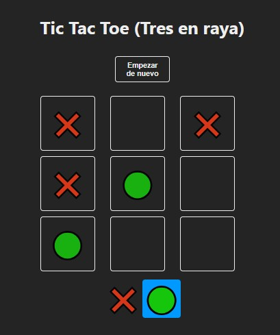

# Tic Tac Toe en React

¡Bienvenido al clásico juego de Tic Tac Toe, ahora en React! Este juego simple pero divertido te permite disfrutar de horas de diversión compitiendo contra un amigo para lograr tres en línea.

## Características

- Interfaz intuitiva y fácil de usar.
- Juega contra un amigo en el mismo dispositivo.
- Alternancia automática entre los turnos de los jugadores.
- ¡Gana el primero en conseguir tres en línea!
  
## Instalación

1. Clona este repositorio en tu máquina local usando `git clone`.
2. Navega hasta el directorio del juego usando `cd tic-tac-toe`.
3. Instala las dependencias usando `npm install`.
4. Inicia el juego con `npm start`.
5. Abre tu navegador y ve a `http://localhost:3000` para jugar.

## Cómo jugar

1. Una vez que el juego se haya cargado en tu navegador, verás un tablero de 3x3.
2. Para empezar, elige quién será el jugador X y quién será el jugador O.
3. El jugador X comienza, haciendo clic en cualquier celda vacía del tablero.
4. Los jugadores se turnan para colocar su marca (X o O) en una celda vacía.
5. El primer jugador en alinear tres de sus marcas en línea horizontal, vertical o diagonal gana.
6. Si todas las celdas están ocupadas y no hay un ganador, el juego termina en empate.

¡Disfruta jugando y que gane el mejor!

## Contribuir

¡Siéntete libre de contribuir a este proyecto! Si tienes ideas para mejorar el juego, puedes crear una nueva rama, implementar tus cambios y enviar un pull request. Estaré encantado de revisarlo y fusionarlo si es apropiado.

## Créditos

Este juego fue desarrollado por [Creyes](https://github.com/creyeschaponan) como parte de un proyecto de aprendizaje de React. Se basa en el tutorial oficial de React.

## Licencia

Este proyecto está bajo la licencia [MIT](LICENSE).
